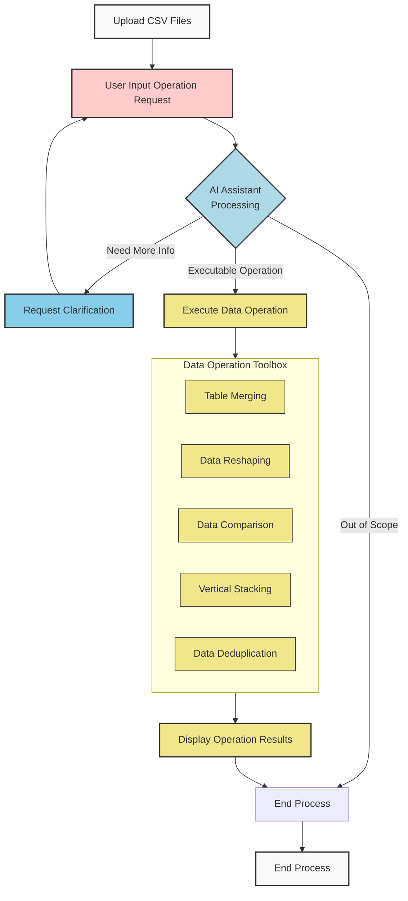

# Agentic Table Playground

[中文版本 (Chinese Version)](README_zh.md)

An agentic table processing playground powered by LLM agents for seamless data manipulation.

An experimental agentic table processing platform that leverages AI agent technology to enable complex table data operations through natural language interaction. The system understands and executes user instructions in plain English, supporting table merging, data reshaping, dataset comparison, and other features. It demonstrates how AI agents can handle complex multi-step data processing workflows.

## Core Features

- **🔗 Table Merging**: Match information from two or more related tables, similar to Excel's VLOOKUP function
- **🔄 Data Reshaping**: Adjust data structure, including converting wide tables to long tables (multiple columns to one column), or long tables to wide tables (one column to multiple columns)
- **⚖️ Data Comparison**: Compare consistency or differences in specified information between two tables, identifying mismatched records
- **📊 Vertical Merging**: Vertically merge multiple tables with similar structures into one large table
- **🧹 Data Deduplication**: Remove duplicate records, supporting complete duplicates or field-specific deduplication
- **🤖 Intelligent Understanding**: Describe complex multi-step data processing requirements through natural language

## Technical Architecture

### System Workflow Diagram



### Component Details

- **Frontend**: Streamlit - Clean web interface
- **Backend**: Python + Pandas - Powerful data processing capabilities
- **AI Engine**: LangChain + OpenAI - Natural language understanding
- **Vector Database**: Milvus - Tool retrieval and example matching
- **Monitoring**: Langfuse - LLM call monitoring and optimization

### Data Flow

1. **User Input**: Users upload CSV/Excel files and describe operations in natural language
2. **AI Processing**: LangChain processes the query using OpenAI models
3. **Tool Retrieval**: Vector database finds relevant table operation tools
4. **Operation Execution**: Backend executes the appropriate pandas operations
5. **Result Display**: Processed data is displayed and made available for download

## Quick Start

### Prerequisites

- Python 3.12 or higher
- [uv](https://docs.astral.sh/uv/) package manager (recommended) or pip

### Local Development Setup (Recommended)

1. **Clone the repository:**
   ```bash
   git clone <your-repository-url>
   cd agentic-table-playground
   ```

2. **Install uv package manager** (if not already installed):
   ```bash
   # On macOS and Linux
   curl -LsSf https://astral.sh/uv/install.sh | sh

   # On Windows
   powershell -c "irm https://astral.sh/uv/install.ps1 | iex"

   # Or using pip
   pip install uv
   ```

3. **Configure environment variables:**
   ```bash
   cp .env.example .env
   ```
   Edit `.env` file and fill in the necessary API keys:
   - `OPENAI_API_KEY`: Your OpenAI API key (required)
   - `OPENAI_API_BASE`: Custom OpenAI API base URL (optional, for Azure OpenAI or compatible APIs)
   - `OPENAI_MODEL`: OpenAI model to use (default: gpt-4o-mini)
   - `EMBEDDING_API_BASE`: Custom embedding API base URL (optional, for custom embedding services)
   - `LANGFUSE_*`: Langfuse monitoring keys (optional)
   - `VECTOR_DB_*`: Milvus configuration (optional, for advanced features)
     - `VECTOR_DB_HOST`, `VECTOR_DB_PORT`, `VECTOR_DB_DATABASE`: Connection settings
     - `VECTOR_DB_USER`, `VECTOR_DB_PASSWORD`: Authentication (optional for local dev)
     - `VECTOR_DB_TOKEN`: Token-based auth for cloud services (optional)
     - `VECTOR_EMBEDDING_DIMENSION`: Vector dimension for embeddings (default: 1024)

4. **Install dependencies and run the application:**
   ```bash
   # Install dependencies
   uv sync

   # Start the application
   uv run streamlit run frontend/app.py
   ```

5. **Access the application:**
   Open your browser and visit `http://localhost:8501`

### Alternative: Using pip

If you prefer using pip instead of uv:

```bash
# Install dependencies
pip install -e .

# Start the application
streamlit run frontend/app.py
```

### Using External Services

If you want to use external Langfuse or Milvus services, simply configure the connection information in the `.env` file.

### Initialize Vector Database (Optional)

For optimal AI tool retrieval performance, you can import the demo dataset if you have a Milvus instance running:

```bash
# Import tool descriptions and example data
python scripts/import_data_to_milvus.py
```

This imports tool descriptions and example queries into Milvus, enabling the AI to better understand user requirements and select appropriate tools.

## How to Use

1. **Upload Data**: Supports CSV and Excel file uploads, with multiple file upload capability
2. **Natural Language Description**: Describe your data processing requirements in simple English
3. **Agentic Execution**: AI agents automatically analyze requirements and execute corresponding table operations
4. **Results Preview**: View processing results in real-time and download them

## License

This project is licensed under the MIT License. See the [LICENSE](LICENSE) file for details.

## Disclaimer

This project is in experimental stage and is primarily intended for learning and research purposes. Please use with caution in production environments and assume responsibility for any associated risks.