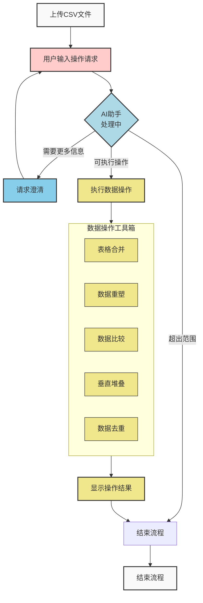

# Agentic Table Playground

[English Version](README.md)

基于 LLM Agent 的智能表格处理实验平台，实现无缝数据操作。

一个实验性的智能表格处理平台，利用 AI Agent 技术通过自然语言交互实现复杂的表格数据操作。系统能够理解并执行用户的中文指令，支持表格合并、数据重塑、数据集比较等功能。展示了 AI Agent 如何处理复杂的多步骤数据处理工作流。

## 核心功能

- **🔗 表格合并**：匹配两个或多个相关表格的信息，类似Excel的VLOOKUP功能
- **🔄 数据重塑**：调整数据结构，包括宽表转长表（多列转一列）或长表转宽表（一列转多列）
- **⚖️ 数据比较**：比较两个表格中指定信息的一致性或差异，识别不匹配的记录
- **📊 垂直合并**：将多个结构相似的表格垂直合并为一个大表
- **🧹 数据去重**：删除重复记录，支持完全重复或特定字段去重
- **🤖 智能理解**：通过自然语言描述复杂的多步骤数据处理需求

## 系统架构

### 系统工作流程图



### 技术栈

- **前端**：Streamlit - 简洁的Web界面
- **后端**：Python + Pandas - 强大的数据处理能力
- **AI引擎**：LangChain + OpenAI - 自然语言理解
- **向量数据库**：Milvus - 工具检索和示例匹配
- **监控**：Langfuse - LLM调用监控和优化

## 快速开始

### 前置要求

- Python 3.12 或更高版本
- [uv](https://docs.astral.sh/uv/) 包管理器（推荐）或 pip

### 本地开发设置（推荐）

1. **克隆仓库：**
   ```bash
   git clone <your-repository-url>
   cd agentic-table-playground
   ```

2. **安装uv包管理器**（如果尚未安装）：
   ```bash
   # 在 macOS 和 Linux 上
   curl -LsSf https://astral.sh/uv/install.sh | sh

   # 在 Windows 上
   powershell -c "irm https://astral.sh/uv/install.ps1 | iex"

   # 或使用 pip
   pip install uv
   ```

3. **配置环境变量：**
   ```bash
   cp .env.example .env
   ```
   编辑 `.env` 文件并填入必要的API密钥：
   - `OPENAI_API_KEY`：您的OpenAI API密钥（必需）
   - `OPENAI_API_BASE`：自定义OpenAI API基础URL（可选，用于Azure OpenAI或兼容API）
   - `OPENAI_MODEL`：使用的OpenAI模型（默认：gpt-4o-mini）
   - `EMBEDDING_API_BASE`：自定义嵌入API基础URL（可选，用于自定义嵌入服务）
   - `LANGFUSE_*`：Langfuse监控密钥（可选）
   - `VECTOR_DB_*`：Milvus配置（可选，用于高级功能）
     - `VECTOR_DB_HOST`, `VECTOR_DB_PORT`, `VECTOR_DB_DATABASE`：连接设置
     - `VECTOR_DB_USER`, `VECTOR_DB_PASSWORD`：认证信息（本地开发可选）
     - `VECTOR_DB_TOKEN`：云服务的令牌认证（可选）
     - `VECTOR_EMBEDDING_DIMENSION`：嵌入向量维度（默认：1024）

4. **安装依赖并运行应用：**
   ```bash
   # 安装依赖
   uv sync

   # 启动应用
   uv run streamlit run frontend/app.py
   ```

5. **访问应用：**
   打开浏览器访问 `http://localhost:8501`

### 替代方案：使用pip

如果您更喜欢使用pip而不是uv：

```bash
# 安装依赖
pip install -e .

# 启动应用
streamlit run frontend/app.py
```

### 使用外部服务

如果您想使用外部的Langfuse或Milvus服务，只需在`.env`文件中配置连接信息即可。

### 初始化向量数据库（可选）

为了获得最佳的AI工具检索效果，如果您有运行中的Milvus实例，可以导入演示数据集：

```bash
# 导入工具描述和示例数据
python scripts/import_data_to_milvus.py
```

这会将工具描述和示例查询导入到Milvus中，让AI能够更准确地理解用户需求并选择合适的工具。

## 使用方法

1. **上传数据**：支持CSV和Excel文件上传，可上传多个文件
2. **自然语言描述**：用简单的中文描述您的数据处理需求
3. **智能执行**：AI自动分析需求并执行相应的表格操作
4. **结果预览**：实时查看处理结果并下载

## 许可证

本项目采用MIT许可证。详情请参阅[LICENSE](LICENSE)文件。

## 免责声明

本项目处于实验阶段，主要用于学习和研究目的。请在生产环境中谨慎使用，并对任何相关风险承担责任。
